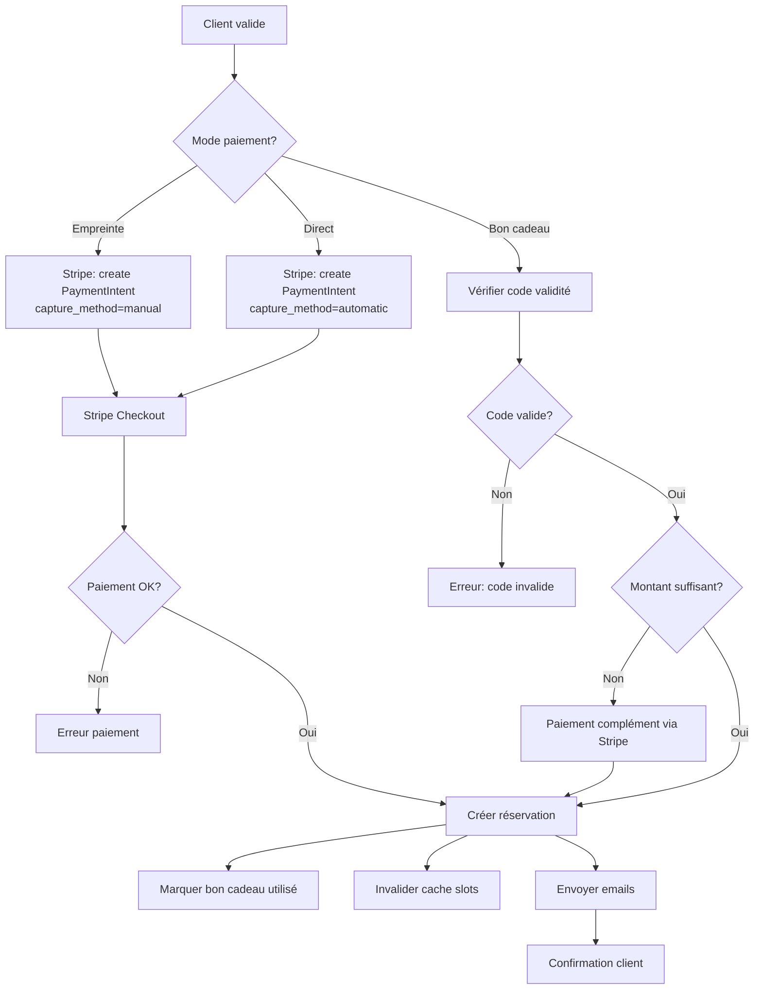

# 📅 Système de Réservation & Prestations - Kalm Headspa

> Documentation complète du système de réservation en ligne développé pour Kalm Headspa
> **Dernière mise à jour** : 26 février 2026

---

## 📋 Table des matières

1. [Vue d'ensemble](#vue-densemble)
2. [Architecture](#architecture)
3. [Gestion des Prestations](#gestion-des-prestations)
4. [Gestion des Extras](#gestion-des-extras)
5. [Système de Planning](#système-de-planning)
6. [Calcul des Créneaux Disponibles](#calcul-des-créneaux-disponibles)
7. [Processus de Réservation](#processus-de-réservation)
8. [Modes de Paiement](#modes-de-paiement)
9. [Gestion Admin](#gestion-admin)
10. [API & Routes](#api--routes)
11. [Cache & Performance](#cache--performance)

---

## 🎯 Vue d'ensemble

Le système de réservation de Kalm Headspa permet aux clients de :
- Parcourir les prestations disponibles (Head Spa, massages)
- Sélectionner une prestation avec variantes (selon longueur de cheveux)
- Choisir des options extras (massage des épaules, traitement capillaire, etc.)
- Réserver un créneau horaire disponible
- Payer en ligne (Stripe) ou utiliser un bon cadeau

### Caractéristiques principales

✅ **Prestations à variantes** : Prix et durée variables selon la longueur de cheveux
✅ **Options extras** : Extensions modulaires de prestations
✅ **Planning flexible** : Templates horaires hebdomadaires + overrides ponctuels
✅ **Temps tampon** : Délai automatique entre réservations (nettoyage/aération)
✅ **3 modes de paiement** : Empreinte bancaire, paiement direct, bon cadeau
✅ **Cache intelligent** : Optimisation des performances avec invalidation automatique
✅ **Timezone France** : Gestion automatique CET/CEST (Paris)

---

## 🏗️ Architecture

### Stack technique

| Composant | Technologie | Description |
|-----------|-------------|-------------|
| **Frontend** | Next.js 15 (App Router) | React Server Components + Client Components |
| **Base de données** | Supabase (PostgreSQL) | RLS activé, clés service_role pour admin |
| **Paiement** | Stripe | Payment Intents (hold + capture) |
| **Email** | Resend | Notifications client + admin |
| **Timezone** | Europe/Paris | Gestion automatique CET/CEST via Intl API |

### Tables Supabase principales

```
services                  → Prestations principales
├── service_variants      → Variantes (prix selon longueur cheveux)
├── service_extras        → Liaison service ↔ extras
└── buffer_time          → Temps tampon après prestation

extras                    → Options supplémentaires

schedule_templates        → Templates horaires hebdomadaires
├── schedule_hours        → Heures par jour/plage
└── schedule_config       → Template actif global

planning_overrides        → Exceptions au planning (semaine fermée, custom)

bookings                  → Réservations clients
slots_cache              → Cache des créneaux disponibles (TTL 30min)
gift_cards               → Bons cadeaux
```

---

## 💆 Gestion des Prestations

### Types de prestations

#### 1. **Prestation simple**
- Prix et durée fixes
- Exemple : Massage corps 60min - 80€

#### 2. **Prestation à variantes**
- Prix et durée variables selon longueur de cheveux
- Exemple : Head Spa Japonais
  - Cheveux courts : 75min - 85€
  - Cheveux mi-longs : 90min - 95€
  - Cheveux longs : 105min - 105€

### Structure d'une prestation

```typescript
interface Service {
  id: string                    // Slug (ex: "head-spa-japonais")
  name: string                  // Nom affiché
  category: string              // Catégorie (headspa-japonais, massage, etc.)
  description: string           // Description détaillée
  has_variants: boolean         // Simple ou variantes ?
  buffer_time: number           // Temps tampon en minutes (défaut: 15)
  is_active: boolean            // Visible sur le site ?
  sort_order: number            // Ordre d'affichage

  // Si has_variants = false
  duration?: number             // Durée en minutes
  price?: number                // Prix en euros
  hair_length?: string          // Type (optionnel)

  // Si has_variants = true
  service_variants?: Variant[]  // Liste des variantes
}
```

### Temps tampon (Buffer Time)

**Problème résolu** : Éviter l'enchaînement trop rapide des prestations.

**Fonctionnement** :
- Chaque service a un `buffer_time` (défaut : 15 minutes)
- Ce temps est ajouté **automatiquement** après chaque réservation
- Les créneaux suivants sont espacés de `durée + buffer_time`
- Le buffer n'est **pas facturé** au client

**Exemple concret** :
```
Service : Sérénité (30 min) + Buffer (15 min) = 45 min total
Horaires : 10h - 14h

Créneaux générés :
✅ 10h00 - 10h30  (réservable)
✅ 10h45 - 11h15  (réservable)  ← +15 min de buffer
✅ 11h30 - 12h00  (réservable)  ← +15 min de buffer
✅ 12h15 - 12h45  (réservable)  ← +15 min de buffer
✅ 13h00 - 13h30  (réservable)  ← +15 min de buffer
❌ 13h45 - 14h15  (dépasse 14h)
```

**Impact sur les chevauchements** :
- Si réservation à 10h (30 min + 15 buffer) → bloque jusqu'à 10h45
- Premier créneau dispo suivant : 10h45

### Catégories disponibles

- `headspa-japonais` : Head Spa Japonais
- `headspa-holistique` : Head Spa Holistique
- `massage` : Massages

---

## ✨ Gestion des Extras

### Concept

Les **extras** sont des options supplémentaires proposées lors de la réservation d'une prestation.

**Exemples** :
- 15 minutes de massage des épaules (+10€)
- Traitement capillaire premium (+15€)
- Soin visage relaxant (+20€)

### Assignation aux prestations

Chaque prestation peut avoir des extras spécifiques :
- **Interface admin** : Cocher les extras disponibles pour chaque service
- **Table** : `service_extras` (liaison many-to-many)
- **Affichage client** : Les extras apparaissent à l'étape 2 de la réservation

### Structure d'un extra

```typescript
interface Extra {
  id: string              // UUID
  name: string            // "15 minutes de massage"
  price: number           // 10.00 (en euros)
  is_active: boolean      // Visible ?
  sort_order: number      // Ordre d'affichage
}
```

### Cumul des prix

```typescript
Prix total = Prix service + Σ(Prix extras sélectionnés)

Exemple :
- Head Spa Japonais (cheveux longs) : 105€
- + Massage épaules : 10€
- + Traitement capillaire : 15€
= 130€ total
```

---

## 🕐 Système de Planning

### Architecture du planning

Le planning hebdomadaire fonctionne avec **3 niveaux** :

#### 1. **Templates horaires** (`schedule_templates`)

Templates réutilisables pour définir les horaires récurrents.

**Exemples** :
- **Semaine impaire** : Lun-Ven 9h-12h / 13h-19h, Sam 9h-17h
- **Semaine paire** : Lun-Ven 10h-18h, Sam fermé
- **Vacances été** : Tous les jours 10h-16h

**Structure** :
```typescript
interface ScheduleTemplate {
  id: string              // "semaine-impaire"
  label: string           // "Semaine impaire"
  schedule_hours: {
    day_label: string     // "Lundi" ou "Lundi - Vendredi"
    hours: string         // "09h-12h / 13h-19h" ou "Fermé"
    sort_order: number
  }[]
}
```

#### 2. **Template actif** (`schedule_config`)

Un seul template actif par défaut pour toutes les semaines.

```sql
SELECT active_template FROM schedule_config WHERE id = 1;
-- Retourne : "semaine-impaire"
```

#### 3. **Overrides ponctuels** (`planning_overrides`)

Exceptions pour des semaines spécifiques.

**Types d'overrides** :
- `closed` : Semaine fermée (vacances)
- `template` : Utiliser un autre template pour cette semaine
- `custom` : Horaires personnalisés uniques

**Exemple** :
```typescript
{
  week_start: "2026-08-03",  // Lundi de la semaine
  type: "closed",
  label: "Vacances d'été"
}
```

### Résolution du planning

**Algorithme** (pour une date donnée) :
1. Calculer le lundi de la semaine
2. Chercher un override pour ce lundi
3. Si override existe :
   - Si `type = closed` → Aucun créneau
   - Si `type = template` → Utiliser le template spécifié
   - Si `type = custom` → Utiliser les horaires custom
4. Sinon → Utiliser le template actif par défaut

### Gestion des jours fériés / exceptions

**Interface admin** : `/admin/planning`
- Navigation par semaine (18 semaines à l'avance)
- 4 modes :
  - **Template actif** : Horaires par défaut
  - **Autre template** : Changer de template pour la semaine
  - **Personnalisé** : Modifier jour par jour
  - **Fermé** : Bloquer toute réservation

---

## 🎰 Calcul des Créneaux Disponibles

### Fichier source

**`lib/slots.ts`** : `generateSlots(cacheKey, duration, date, adminMode)`

### Algorithme complet

```typescript
// Étape 1 : Vérifier le cache (mode public uniquement)
if (!adminMode && cached) return cached

// Étape 2 : Récupérer le buffer_time du service
const bufferTime = await getBufferTimeFromService(serviceId)

// Étape 3 : Résoudre le planning de la semaine
const planning = resolvePlanning(weekMonday, overrides, templates)

// Étape 4 : Filtrer les blocs horaires du jour demandé
const dayBlocks = planning.filter(b => b.day_of_week === dayOfWeek)

// Étape 5 : Charger les réservations confirmées du jour
const bookings = await getConfirmedBookings(date)

// Ajouter le buffer_time de chaque booking existant
const bookingsWithBuffer = bookings.map(b => ({
  starts_at: b.starts_at,
  ends_at: b.ends_at + (b.service.buffer_time * 60_000)
}))

// Étape 6 : Générer les créneaux
for (const block of dayBlocks) {
  let cursor = blockStart
  const totalDuration = duration + bufferTime

  while (cursor + duration <= blockEnd) {
    const slotEnd = cursor + duration
    const slotEndWithBuffer = cursor + totalDuration

    // Vérifier chevauchement avec réservations (incluant leur buffer)
    if (!overlaps(cursor, slotEndWithBuffer, bookingsWithBuffer)) {
      slots.push({
        starts_at: cursor,
        ends_at: slotEnd  // Sans le buffer dans le retour
      })
    }

    cursor += totalDuration  // Avancer avec le buffer
  }
}

// Étape 7 : Filtre 24h minimum (mode public)
if (!adminMode) {
  slots = slots.filter(s => s.starts_at >= now + 24h)
}

// Étape 8 : Mettre en cache
setCachedSlots(cacheKey, date, slots)

return slots
```

### Gestion du buffer dans le calcul

**Impact sur l'espacement** :
```javascript
// AVANT (sans buffer) :
cursor += duration  // Créneaux collés

// APRÈS (avec buffer) :
cursor += duration + bufferTime  // Créneaux espacés
```

**Impact sur les chevauchements** :
```javascript
// On vérifie que le créneau + son buffer ne chevauche pas
// une réservation existante + son buffer

const overlaps = bookingsWithBuffer.some(b => {
  return slotStart < b.ends_at && slotEndWithBuffer > b.starts_at
})
```

### Timezone Paris (CET/CEST)

**Problème** : France = UTC+1 (hiver) ou UTC+2 (été)

**Solution** : Fonction `parisTimeToUTCIso()`
```typescript
// Convertit "2026-08-15" + "10:00" (heure Paris)
// en ISO UTC (gère automatiquement CET/CEST)

parisTimeToUTCIso("2026-03-15", "10:00")
// → "2026-03-15T09:00:00.000Z" (UTC+1 = CET)

parisTimeToUTCIso("2026-08-15", "10:00")
// → "2026-08-15T08:00:00.000Z" (UTC+2 = CEST)
```

**Méthode** : Utilise `Intl.DateTimeFormat` avec `timeZone: 'Europe/Paris'`

---

## 🛒 Processus de Réservation

### Parcours client

**Route** : `/reservation`

#### Étape 1 : Sélection du service

- Affichage de toutes les prestations actives
- Regroupées par catégorie
- Si variantes → Sélectionner longueur de cheveux
- Résultat : `serviceId` + `variantId` (optionnel)

#### Étape 2 : Options extras

- Affichage des extras assignés à ce service
- Checkboxes avec prix
- Calcul du total en temps réel
- Résultat : `selectedExtras[]`

#### Étape 3 : Choix de la date et du créneau

**Interface** :
1. Calendrier (18 semaines à l'avance)
2. Sélection d'une date
3. Chargement des créneaux via `/api/slots?resourceId=X&date=Y`
4. Affichage en grille horaire
5. Sélection d'un créneau
6. Résultat : `date`, `startsAt`, `endsAt`

**Contrainte** : Minimum 24h à l'avance (sauf admin)

#### Étape 4 : Informations client

Formulaire :
- Nom complet
- Email
- Téléphone
- Message optionnel

#### Étape 5 : Paiement

3 options possibles :
1. **Empreinte bancaire** (hold)
2. **Paiement direct**
3. **Bon cadeau**

### Flow de confirmation



---

## 💳 Modes de Paiement

### 1. Empreinte bancaire (Hold)

**Use case** : Garantir la présence du client sans prélever immédiatement

**Flow** :
1. Client entre sa CB
2. Stripe bloque le montant (`requires_capture`)
3. Réservation créée avec `payment_mode: 'hold'`
4. **À J-1 ou le jour J** : Admin capture ou annule
   - Capture → Argent prélevé
   - Annule → Argent libéré

**Code** :
```typescript
const paymentIntent = await stripe.paymentIntents.create({
  amount: totalCents,
  currency: 'eur',
  capture_method: 'manual',  // ← Empreinte
  metadata: { bookingId, clientEmail }
})
```

### 2. Paiement direct

**Use case** : Prélèvement immédiat (prestations prépayées)

**Flow** :
1. Client entre sa CB
2. Stripe prélève immédiatement
3. Réservation créée avec `payment_mode: 'direct'`

**Code** :
```typescript
const paymentIntent = await stripe.paymentIntents.create({
  amount: totalCents,
  currency: 'eur',
  capture_method: 'automatic',  // ← Prélèvement immédiat
  metadata: { bookingId, clientEmail }
})
```

### 3. Bon cadeau

**Use case** : Client a acheté un bon cadeau en ligne

**Flow** :
1. Client entre le code
2. Vérification validité (`gift_cards` table)
3. Si montant < prix service → Complément Stripe
4. Si montant >= prix service → Pas de paiement
5. Bon marqué comme `used: true`

**Code** :
```typescript
// Vérifier le bon
const { data: card } = await supabase
  .from('gift_cards')
  .select('*')
  .eq('code', code.toUpperCase())
  .eq('used', false)
  .single()

if (!card) throw new Error('Bon invalide')

// Si complément nécessaire
if (card.amount < totalPrice) {
  const complement = totalPrice - card.amount
  // Créer PaymentIntent pour le complément
}

// Marquer comme utilisé
await supabase
  .from('gift_cards')
  .update({
    used: true,
    used_at: now,
    used_booking_id: bookingId
  })
  .eq('code', code)
```

---

## 🎛️ Gestion Admin

### Interface d'administration

**Route** : `/admin` (protégé par auth)

#### Pages disponibles

| Route | Description | Fonctionnalités |
|-------|-------------|----------------|
| `/admin/agenda` | Vue calendrier | Liste des réservations par jour |
| `/admin/reservations` | Liste des réservations | Filtres, statuts, détails |
| `/admin/prestations` | Gestion des services | CRUD services + variantes + extras assignés |
| `/admin/extras` | Gestion des extras | CRUD extras indépendants |
| `/admin/horaires` | Templates horaires | CRUD templates + horaires par jour |
| `/admin/planning` | Calendrier 18 semaines | Overrides ponctuels, fermetures |

### Réservation manuelle

**Route** : `/api/admin/manual-booking`

**Avantages** :
- Pas de contrainte 24h minimum
- Pas de paiement requis (`payment_mode: 'in_person'`)
- Email optionnel

**Use case** : Client réserve par téléphone

```typescript
POST /api/admin/manual-booking
{
  serviceId: "head-spa-japonais",
  variantId: "head-spa-japonais-1234",
  startsAt: "2026-02-27T10:00:00Z",
  endsAt: "2026-02-27T11:30:00Z",
  clientName: "Marie Dupont",
  clientEmail: "marie@example.com",  // optionnel
  clientPhone: "0612345678",          // optionnel
  note: "Première visite"
}
```

### Gestion des statuts

| Statut | Description | Actions possibles |
|--------|-------------|-------------------|
| `pending` | En attente | Confirmer / Annuler |
| `confirmed` | Confirmée | Annuler / Marquer terminée |
| `cancelled` | Annulée | Réactiver |
| `completed` | Terminée | Archive |
| `no_show` | Client absent | Archive |

---

## 🔌 API & Routes

### Routes publiques

| Endpoint | Méthode | Description |
|----------|---------|-------------|
| `/api/services` | GET | Liste des services actifs |
| `/api/extras` | GET | Liste des extras actifs |
| `/api/slots` | GET | Créneaux disponibles |
| `/api/booking/intent` | POST | Créer PaymentIntent Stripe |
| `/api/booking/confirm` | POST | Confirmer réservation après paiement |
| `/api/booking/gift-card` | POST | Vérifier bon cadeau |

### Routes admin (authentifiées)

| Endpoint | Méthode | Description |
|----------|---------|-------------|
| `/api/services` | POST, PUT, DELETE | CRUD services |
| `/api/extras` | POST, PUT, DELETE | CRUD extras |
| `/api/admin/service-extras` | GET, POST | Liaison service ↔ extras |
| `/api/admin/bookings` | GET, POST | Liste + création manuelle |
| `/api/admin/manual-booking` | GET, POST | Créneaux + résa sans paiement |
| `/api/planning` | GET, POST, DELETE | Gestion planning hebdo |

### Exemple : Créneaux disponibles

```bash
GET /api/slots?resourceId=head-spa-japonais-1234&date=2026-03-15

Response 200:
{
  "slots": [
    {
      "starts_at": "2026-03-15T09:00:00.000Z",
      "ends_at": "2026-03-15T10:30:00.000Z"
    },
    {
      "starts_at": "2026-03-15T10:45:00.000Z",
      "ends_at": "2026-03-15T12:15:00.000Z"
    }
  ]
}
```

---

## ⚡ Cache & Performance

### Système de cache (`slots_cache`)

**Problème** : Calcul des créneaux coûteux (DB queries + timezone)

**Solution** : Cache avec TTL 30 minutes

#### Fonctionnement

```typescript
// Lecture cache
const cached = await getCachedSlots(serviceId, date)
if (cached && age < 30min) return cached

// Calcul + stockage
const slots = await computeSlots(...)
await setCachedSlots(serviceId, date, slots)
```

#### Invalidation automatique

**Événements déclencheurs** :
1. Nouvelle réservation créée
2. Réservation annulée
3. Planning modifié
4. Service modifié (durée, buffer)

**Code** :
```typescript
// Après création booking
await invalidateSlotsCache(serviceId, date)

// Après modification planning global
await invalidateAllSlotsCache()
```

### Performance observée

| Opération | Sans cache | Avec cache |
|-----------|-----------|-----------|
| Calcul créneaux | ~300-500ms | ~10-20ms |
| Charge DB | 4-5 queries | 1 query |
| Expérience UX | Lag visible | Instantané |

---

## 📧 Notifications Email

### Service : Resend

**Templates** : Emails transactionnels en React (JSX)

### Emails envoyés

#### 1. Confirmation client

**Destinataire** : Client
**Trigger** : Réservation confirmée
**Contenu** :
- Récapitulatif prestation
- Date, heure, durée
- Extras sélectionnés
- Prix total
- Coordonnées du salon
- Bouton "Annuler ma réservation"

#### 2. Notification admin

**Destinataire** : Admin (email configuré)
**Trigger** : Nouvelle réservation
**Contenu** :
- Infos client (nom, email, tel)
- Détails prestation
- Mode de paiement
- Message client (si fourni)

### Configuration

```env
RESEND_API_KEY=re_xxx
RESEND_FROM_EMAIL=noreply@kalm-headspa.fr
ADMIN_EMAIL=contact@kalm-headspa.fr
```

---

## 🔐 Sécurité & Règles métier

### Protection anti-bypass

**Délai 24h minimum** :
```typescript
// Vérification côté serveur (incontournable)
const cutoff = Date.now() + 24 * 60 * 60 * 1000
if (new Date(startsAt) < cutoff) {
  throw new Error('Minimum 24h à l\'avance')
}
```

**Pourquoi serveur ?** → Le client peut modifier le code front

### Validation des paiements

```typescript
// TOUJOURS vérifier le PaymentIntent côté serveur
const pi = await stripe.paymentIntents.retrieve(paymentIntentId)

if (mode === 'hold' && pi.status !== 'requires_capture') {
  throw new Error('Empreinte invalide')
}

if (mode === 'direct' && pi.status !== 'succeeded') {
  throw new Error('Paiement non confirmé')
}
```

### RLS Supabase

**Tables publiques** (lecture seule) :
- `services` (is_active = true)
- `extras` (is_active = true)
- `schedule_templates`, `schedule_hours`

**Tables protégées** :
- `bookings` → Créées via service_role uniquement
- `planning_overrides` → Admin uniquement
- `gift_cards` → Admin uniquement

---

## 🚀 Déploiement & Configuration

### Variables d'environnement

```env
# Supabase
NEXT_PUBLIC_SUPABASE_URL=https://xxx.supabase.co
NEXT_PUBLIC_SUPABASE_ANON_KEY=eyJxxx
SUPABASE_SERVICE_ROLE_KEY=eyJxxx  # ⚠️ Secret serveur

# Stripe
NEXT_PUBLIC_STRIPE_PUBLISHABLE_KEY=pk_live_xxx
STRIPE_SECRET_KEY=sk_live_xxx
STRIPE_WEBHOOK_SECRET=whsec_xxx

# Resend
RESEND_API_KEY=re_xxx
RESEND_FROM_EMAIL=noreply@kalm-headspa.fr
ADMIN_EMAIL=contact@kalm-headspa.fr

# Auth admin
ADMIN_PASSWORD=xxx  # Hashé en bcrypt
```

### Checklist déploiement

- [ ] Exécuter toutes les migrations SQL
- [ ] Créer le template horaire actif
- [ ] Configurer les services + variantes
- [ ] Créer les extras
- [ ] Assigner extras aux services
- [ ] Configurer Stripe webhooks
- [ ] Tester parcours complet réservation
- [ ] Vérifier emails (client + admin)
- [ ] Vérifier timezone (créneaux corrects)

---

## 🐛 Debugging & Logs

### Logs serveur

**Fichiers clés** :
- `lib/slots.ts` : Génération créneaux
- `app/api/booking/confirm/route.ts` : Confirmation réservation
- `lib/email.ts` : Envoi emails

**Console** :
```bash
# Dev
pnpm dev

# Logs Vercel (production)
vercel logs <deployment-url>
```

### Problèmes courants

#### ❌ "Aucun créneau disponible"

**Causes** :
1. Planning fermé pour cette semaine
2. Tous les créneaux réservés
3. Buffer trop élevé (pas assez d'espace)
4. Erreur timezone (créneaux décalés)

**Debug** :
```typescript
// Vérifier le planning résolu
const planning = resolvePlanning(weekMonday, ...)
console.log('[Planning]', planning)

// Vérifier les bookings du jour
const bookings = await getConfirmedBookings(date)
console.log('[Bookings]', bookings)
```

#### ❌ "Paiement non confirmé"

**Causes** :
1. Webhook Stripe non reçu
2. PaymentIntent status incorrect
3. Test mode vs Live mode

**Debug** :
```bash
# Stripe CLI (test webhooks localement)
stripe listen --forward-to localhost:3000/api/webhooks/stripe
```

#### ❌ Emails non reçus

**Causes** :
1. RESEND_API_KEY invalide
2. Email domain non vérifié
3. Spam folder

**Debug** :
```typescript
// Logs Resend dashboard
https://resend.com/emails
```

---

## 📊 Métriques & Analytics

### KPIs à surveiller

| Métrique | Description | Cible |
|----------|-------------|-------|
| **Taux de conversion** | Résa confirmées / Visites | >15% |
| **Panier moyen** | Prix moyen par réservation | >80€ |
| **Extras attachment** | % résa avec extras | >30% |
| **No-show rate** | % clients absents | <5% |
| **Délai moyen réservation** | Jours entre résa et prestation | 7-14j |

### Requêtes SQL utiles

```sql
-- Taux de conversion par mois
SELECT
  DATE_TRUNC('month', created_at) AS month,
  COUNT(*) FILTER (WHERE status = 'confirmed') AS confirmed,
  COUNT(*) AS total,
  ROUND(100.0 * COUNT(*) FILTER (WHERE status = 'confirmed') / COUNT(*), 2) AS conversion_rate
FROM bookings
GROUP BY month
ORDER BY month DESC;

-- Top 5 services
SELECT
  service_name,
  COUNT(*) AS bookings,
  ROUND(AVG(price), 2) AS avg_price
FROM bookings
WHERE status = 'confirmed'
GROUP BY service_name
ORDER BY bookings DESC
LIMIT 5;

-- Extras les plus populaires
SELECT
  e.name,
  COUNT(*) AS times_booked
FROM bookings b,
     LATERAL jsonb_array_elements(b.extras_json) AS extra,
     extras e
WHERE extra->>'name' = e.name
GROUP BY e.name
ORDER BY times_booked DESC;
```

---

## 🔄 Évolutions futures

### Roadmap

#### Court terme (Q2 2026)
- [ ] SMS de rappel J-1 (Twilio)
- [ ] Programme fidélité (points)
- [ ] Annulation en ligne (remboursement partiel)
- [ ] Multi-ressources (2 praticiens en parallèle)

#### Moyen terme (Q3-Q4 2026)
- [ ] Application mobile (React Native)
- [ ] Chat en ligne (support)
- [ ] Avis clients post-prestation
- [ ] Recommandations personnalisées (ML)

#### Long terme (2027)
- [ ] Multi-établissements
- [ ] Abonnements mensuels
- [ ] Marketplace partenaires (produits)
- [ ] API publique (intégrations tierces)

---

## 📞 Support & Maintenance

### Contact développeur

**Vincent Anglo**
Email : vanglo@hotmail.fr
Agence : WMM Digital Agency

### Documentation technique

- **Next.js** : https://nextjs.org/docs
- **Supabase** : https://supabase.com/docs
- **Stripe** : https://stripe.com/docs/api
- **Resend** : https://resend.com/docs

### Licence

Propriété de **Kalm Headspa** (Gwenaëlle Bazin)
Développé par **WMM Digital Agency**
© 2026 - Tous droits réservés

---

**Dernière mise à jour** : 26 février 2026
**Version** : 1.0.0
